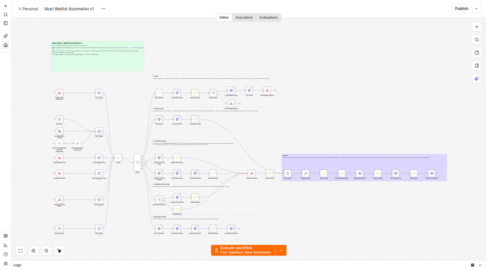
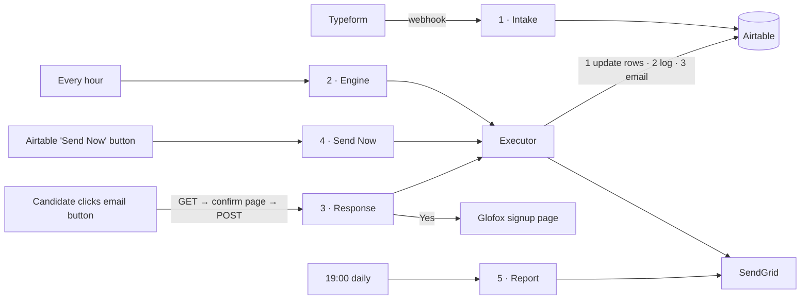

# Akari Sauna · Waitlist Automation v1 — Build & Test Guide

Source of truth: Eraser board **Waitlist Automation_1.0** (11 Sep call notes + architecture diagram) plus the **24 Sep client clarifications** (email first, 24h hold covers tours, Send Now at any time, manual reorder permanent).



## 0. What's in the box

| File | Purpose |
|---|---|
| `n8n/akari-waitlist-automation.json` | **Import this.** The whole automation: 54 working nodes (+7 notes) in 5 lanes + a shared executor. |
| `n8n/akari-waitlist-error-alert.json` | **Import this too.** Emails you when any execution fails. |
| `airtable/setup-airtable.mjs` | Optional: creates the base (or adds to an existing one) with the three tables, correct field types and 12 seeded queues. |
| `src/` | Source for every Code node (the JSON is generated from here). |
| `build/build-workflow.mjs` | Rebuilds the JSON from `src/` (`npm run build`). |
| `test/` | 46 unit tests (`npm test`) and a 16-check end-to-end run in real n8n (`npm run e2e`). |

**What has been verified**

| Check | Result |
|---|---|
| Business rules (46 unit tests) | ✅ pass |
| Imported into **n8n 2.40.6** with the CLI and published; every lane driven through its real webhooks against strict mock Airtable/SendGrid services (auth, 10-record batches, formula filters, pagination, 5 req/s limit) | ✅ 16/16 |
| Imported through the **n8n editor UI** in Chromium; all 17 HTTP nodes stay linked to credentials; credential ID shown in the URL; error workflow publishes from the UI | ✅ |
| Error workflow fires and emails on a failed execution | ✅ |
| Live Airtable, live SendGrid, live Typeform, n8n 1.x | ❌ Not run from here. Stages 1–3 of the test plan (§6) cover these. Node versions used also exist in n8n ≥ 1.60. |

---

## 1. Scope: what v1 does, traced to the board

| Board requirement | Where it lives |
|---|---|
| **Step 1** Typeform intake: name, email, phone, multi-select memberships × locations; one queue per location + membership; a person can be on several queues | Lane 1 · Intake |
| **Step 2** Spot opens when staff enter an end date in Glofox *(webhook availability pending confirmation)* | Hourly engine re-checks every queue. A Glofox webhook trigger is already wired but **disabled** until Glofox confirms the event exists. |
| **Step 2** Recount current members | `Active Members` on the Capacity table (staff-maintained in v1). |
| **Step 3** Admin minimum per location + membership; below it → work out how many to invite | Capacity table + Plan Engine Actions (gap maths below) |
| **Step 4** Warm people first; "Prioritise new members" toggle; Send Now override | Plan Engine Actions · Lane 4 |
| **Prioritisation** 1 new signup ≈ 3 existing-member upgrades | `newMemberWeight: 3` |
| **24 Sep** Manual reorder stays available permanently | `Manual Rank` column always wins |
| **Step 5** Early heads-up to the next ~10 in each queue | Plan Engine Actions (`primeCount: 10`) |
| **Step 6** Invite by email (SendGrid) with a response window | Executor → SendGrid; `holdHours: 24` |
| **24 Sep** The 24h window *holds the spot*; tours convert at over 90% | Hold counts against the gap. Plus a **"tour first"** response that keeps holding the spot (see A1). |
| **Step 7** Yes → signup link (Glofox handles payment) · Not now → "Not Right Now", manual follow-up · No → "No Longer Interested", reason captured · no reply → Warm, keeps priority | Lane 3 · Candidate response |
| **Notes** Late reply goes to Warm, no penalty | Decide Response |
| **Step 7** Unlimited → removed from other queues automatically; lower tier → asked whether to stay | Decide Response (+ one-click "remove me" link) |
| **Diagram** No-reply bucket, to be re-engaged by a campaign | Second missed window → `No Reply` status |
| **Step 8** Daily email: invited, signed up, not now, no longer interested (with reasons), conversion by location | Lane 5 · Daily report (19:00) |
| **Out of scope** Keep-warm nurture sequence, SMS, live Glofox sync | Not built. SMS can be added later on the same executor. |

## 2. Decisions to confirm with the client

Each one is a single setting or a small code change if they want it different.

| # | What I built | Why | Change it via |
|---|---|---|---|
| A1 | **"I'd like a tour first"** is a 4th response. It holds the spot with no expiry, alerts the team, and staff press **Send Now** after the tour. Tour holds older than 7 days are flagged in the daily report. | The 24 Sep note says tours are *the* reason for the hold. Without this, a tour request would time out after 24h and the spot would move on. | `tourStaleDays`; remove the button in `src/helpers/email.js` |
| A2 | "1 new ≈ 3 upgrades" is applied as **weighted waiting time**: a new member's days waiting count 3×. | Keeps oldest-first fairness while tilting toward new members. | `newMemberWeight` (e.g. `1000` = new members always first) |
| A3 | **Manual Rank beats everything**, including Warm people. | Explicit staff intent should win. | `src/nodes/plan-engine-actions.js` sort |
| A4 | 1st missed window → **Warm**, first in line again after a **72h** cool-off. 2nd miss → **No Reply** bucket. | This is how I read the diagram's "Warm → next time a spot opens → No-reply bucket" arrow. The cool-off stops the engine re-inviting the same person for the same spot an hour later. | `warmCooldownHours`, `timeoutsBeforeNoReply` |
| A5 | A person holds **one live invite at a time** across all their queues. | Avoids two simultaneous offers to the same person. | Plan Engine Actions |
| A6 | **Send Now** sends the same invite email, whose "Yes" button is the tracked signup link. It also counts as a held spot for that queue. | Tracking the "Yes" is what makes the Signed Up status, the reporting and the Unlimited clean-up work. | `src/nodes/build-send-now.js` |
| A7 | **Signed Up = clicked Yes.** Payment happens in Glofox, which we don't read in v1. Signups since staff last updated `Active Members` count against the gap, so the queue isn't over-invited. | There's no Glofox sync in v1. | Keep `Active Members` current; the count resets automatically when edited. |
| A8 | Lower-tier signup: stays on other lists, and the confirmation email has a one-click "remove me from my other waitlists" link. | Board: "asked whether to stay". | — |
| A9 | Invites and heads-ups are only sent **08:00–20:00 New York time**; timeouts are processed around the clock. The engine runs **hourly**. | Nobody gets a 24h clock started at 3am. | `sendWindow`, `Every Hour` trigger |
| A10 | "Prioritise New Only" is **per queue**, a column on Capacity. | The board doesn't say whether it's global; per queue can do both. | Set every row the same for a global switch. |

---

## 3. How it fits together



- Every trigger is tagged with a **route**, passes through the one **Config** node, and a **Route** switch sends it to its lane.
- The lanes only **decide** what to do. They output "action" items: *update this row · maybe send this email · log this event*.
- The **Executor** carries those actions out in a safe order: tokens → Airtable rows → activity log → emails. If an Airtable write fails, no email goes out.

**Gap maths (per queue):** `open spots = Minimum Members − Active Members − signups since last recount − live holds (Invited + Tour Requested)`. The engine invites that many (max 10 per run) in priority order, then sends a heads-up to the next 10 in line who haven't had one.

**Priority order:** Manual Rank (lowest first) → Warm → weighted waiting time → joined first. Existing members are skipped entirely when "Prioritise New Only" is on.

### Status lifecycle (Waitlist › Status)

| Status | Set by | Next |
|---|---|---|
| Waiting | Intake / staff | Primed or Invited |
| Primed | Engine (heads-up sent) | Invited |
| Invited | Engine or Send Now (24h hold) | Signed Up · Tour Requested · Not Right Now · No Longer Interested · Warm (timeout) |
| Tour Requested | Candidate | Staff Send Now after the tour → Invited, or staff edit |
| Warm | 1st timeout or late reply | Re-invited first (after 72h cool-off unless they replied late) |
| No Reply | 2nd timeout | Staff / future campaign |
| Not Right Now | Candidate | Staff follow-up (no auto re-invite) |
| No Longer Interested | Candidate | Closed |
| Signed Up | Candidate clicked Yes | Closed |
| Removed | Unlimited signup elsewhere, or "remove me from other lists" | Closed |

---

## 4. Setup, step by step

### 4.1 Accounts and keys
- **Airtable personal access token** with scopes `data.records:read` and `data.records:write`, plus `schema.bases:read` and `schema.bases:write` if you'll use the setup script. Give it access to the Akari base.
- **SendGrid API key** with *Mail Send* permission. **Authenticate the sending domain (SPF/DKIM) before go-live**: a 24h hold is only fair if the invite lands in the inbox.
- **Typeform** access to the waitlist form.
- **n8n**: Cloud or self-hosted. Tested on 2.40.6. The node versions used also exist in 1.60+.
- **Glofox signup URL** for each location × membership. This is the private link staff send today.

### 4.2 Airtable base
1. Create an empty base (a copy for testing first — see §6).
2. Either run the script:
   ```bash
   # creates a new base "Akari Waitlist" with all three tables (workspace ID is in the URL: airtable.com/workspaces/wsp…)
   AIRTABLE_TOKEN=pat... AIRTABLE_WORKSPACE_ID=wsp... node airtable/setup-airtable.mjs
   # or adds the tables to an existing empty base
   AIRTABLE_TOKEN=pat... AIRTABLE_BASE_ID=app... node airtable/setup-airtable.mjs
   ```
   or build the tables by hand from §8.
3. Add the field Airtable's API can't create (if you built by hand, also add **Capacity › `Active Updated At`**: *Last modified time*, watching **only** `Active Members`; the script creates it for you):
   - **Waitlist › `Send Now`**: *Button* → *Open URL*, with this formula:
     ```
     "https://YOUR-N8N-HOST/webhook/akari-waitlist/send-now?id=" & RECORD_ID() & "&k=YOUR-SEND-NOW-SECRET"
     ```
4. Fill in each Capacity row you'll use: `Minimum Members`, `Active Members`, `Signup URL`, then tick **Enabled** only when you're ready. Queues with no Signup URL never send invites.
5. Migrate the current Excel waitlist: CSV-import into **Waitlist** with `Status = Waiting`, the original date in `Joined At`, `Entry Source = Admin`, and `Member Type = Existing` for upgrades and switches.

### 4.3 n8n credentials
Create two **Header Auth** credentials:

| Credential name | Header name | Header value |
|---|---|---|
| Airtable PAT (Akari) | `Authorization` | `Bearer pat…` |
| SendGrid API Key (Akari) | `Authorization` | `Bearer SG.…` |

Open each one and copy its **ID** from the browser URL (`…/home/credentials/<ID>`).

### 4.4 Prepare the JSON (1 minute)
In **both** JSON files, find and replace:
- `akariAirtablePAT` → your Airtable credential ID
- `akariSendGridKey` → your SendGrid credential ID

Why: n8n drops credential references it can't match by ID when you import, even when the names match (verified in the n8n 2.x editor). With the IDs swapped in, all 17 HTTP nodes arrive already connected. If you skip this, you'll have to pick the credential on each HTTP node by hand.

### 4.5 Import and configure
1. n8n → **Import from file** → `akari-waitlist-error-alert.json`. In **Build Alert Email**, set `fromEmail` and `adminEmails`. Then **Publish** it (2.x: *Publish* → name the version → *Publish*; 1.x: not required). n8n 2.x only runs error workflows that are published.
2. **Import from file** → `akari-waitlist-automation.json`.
3. Open **Config** and set:

| Key | Set to |
|---|---|
| `airtableBaseId` | `app…` from the base URL |
| `publicWebhookBase` | `https://<your-n8n-host>/webhook/akari-waitlist` (production URL, no trailing slash) |
| `fromEmail` / `fromName` / `replyToEmail` | SendGrid-verified sender |
| `teamEmails` | Where daily reports and tour alerts go |
| `sendNowSecret` | A long random string. Must match the Airtable button formula. Until you change it from `CHANGE-ME`, Send Now is refused. |
| `sandboxMode` | Leave `true` until Stage 2 of testing |
| `testRecipient` | Your own inbox for Stage 2, then `''` |

4. Workflow **Settings** → *Error workflow* → **Akari Waitlist · Error Alert**. Check the timezone is America/New_York (it's already set in the JSON).
5. **Publish** (2.x) / **Activate** (1.x). The email links point at production webhook URLs, so response flows only work on a published workflow.

### 4.6 Typeform
Typeform → **Connect → Webhooks** → add `https://<your-n8n-host>/webhook/akari-waitlist/intake` and switch it on. The parser finds fields by type and by matching choice labels, so question wording can change freely. The **choice labels** must still contain the location names (Williamsburg, Greenpoint, Lower East Side/LES) and membership names (Unlimited, Daytime, 4-Visit, Summer Pass). A yes/no question containing "existing … member" sets Member Type automatically.

---

## 5. Node-by-node reference

### Shared entry
| Node | Type | What it does |
|---|---|---|
| Typeform: New Submission | Webhook POST `/akari-waitlist/intake` | Typeform submission in. Responds via node, only after the save. |
| Every Hour | Schedule `0 * * * *` | Runs the engine. |
| Run Engine Now (manual) | Manual trigger | Runs the engine from the editor while testing. |
| Glofox: End Date Entered (pending) + Acknowledge Glofox | Webhook POST `/glofox-end-date` + Respond | **Disabled.** Enable both if Glofox confirms the end-date webhook; it just triggers an extra engine run. |
| Candidate Opens Link | Webhook GET `/respond` | Email button clicked → confirmation page. |
| Candidate Confirms | Webhook POST `/respond-confirm` | Button on the confirmation page → the actual change. |
| Airtable: Send Now Button | Webhook GET `/send-now?id=&k=` | Staff override. |
| Daily Report 7pm | Schedule `0 19 * * *` | Daily summary. |
| Route: Intake / Engine / Response View / Response Commit / Send Now / Report | Set | Tags the item with its lane. |
| **Config** | Code | **The only node to edit.** All settings, URLs and business-rule numbers. |
| Route | Switch | Sends each item to its lane. |

### Lane 1 · Intake
| Node | Type | What it does |
|---|---|---|
| Parse Typeform | Code | Pulls out email (lower-cased), name, phone, member type and every location × membership combination. A submission with no email, location or membership **fails loudly** (error alert). |
| Find Existing Entries | HTTP GET Airtable | This email's current rows. |
| Build New Entries | Code | Skips queues they're already active on; batches new rows 10 at a time. |
| Anything New? | IF | Duplicate submission → just acknowledge. |
| Create Waitlist Entries | HTTP POST Airtable | Creates rows: `Status = Waiting`, `Joined At` = Typeform submit time. |
| Log: Joined | HTTP POST Airtable | One Activity Log row per new entry. |
| Acknowledge Typeform / Acknowledge Duplicate | Respond to Webhook | 200 to Typeform, sent only after rows are saved. A failure returns an error, which is visible in Typeform's webhook delivery log, and fires the error alert. |

### Lane 2 · Engine
| Node | Type | What it does |
|---|---|---|
| Get Capacity | HTTP GET Airtable (paginated) | Enabled queues. |
| Get Active Entries | HTTP GET Airtable (paginated, 500ms between pages) | Waiting / Primed / Invited / Warm / Tour Requested, plus Signed Up in the last 60 days. |
| Plan Engine Actions | Code | 1) Expires holds past 24h (→ Warm / No Reply). 2) Inside the send window, per queue: works out the open spots, invites in priority order, then primes the next 10. Makes no changes itself; outputs actions to the executor. |

### Lane 3 · Candidate response
| Node | Type | What it does |
|---|---|---|
| Find Entry by Token (view) | HTTP GET Airtable | Looks up the row by the link's token. The token is stripped to letters and digits, so it can't inject into the Airtable formula. |
| Render Confirm Page | Code | Confirmation page with one button (plus an optional note or preferred times). **Changes nothing**, so email link scanners can't answer on someone's behalf. |
| Find Entry by Token (commit) | HTTP GET Airtable | Same lookup, for the POST. |
| Find Entries by Email | HTTP GET Airtable | The person's other queues (for Unlimited clean-up / "stay on others"). |
| Find Queue Settings | HTTP GET Airtable | Signup URL for this queue. |
| Decide Response | Code | Yes / tour / not now / no / leave / late-reply rules (§3). Returns the page (Yes redirects to Glofox) plus the actions. |
| Respond with Page | Respond to Webhook | Sends the HTML page (shared by lanes 3 and 4). |
| Unpack Actions | Code | Turns the page's actions into executor items. |

### Lane 4 · Send Now
| Node | Type | What it does |
|---|---|---|
| Send Now Authorised? | IF | Secret matches **and** the id looks like an Airtable record id **and** the secret isn't still `CHANGE-ME`. |
| Get Entry for Send Now | HTTP GET Airtable | The row. |
| Build Send Now | Code | Fresh 24h invite whatever the status, position or queue count. Ignores a second click within 2 minutes. The page warns if test or sandbox mode is on. |
| Forbidden Page | Code | 403 page. |

### Executor (shared)
| Node | Type | What it does |
|---|---|---|
| Action Queue | Wait 1s | Separates the lane's lookups from the writes (Airtable rate limit). |
| Generate Tokens | Crypto (random hex, 48 chars) | Unguessable response-link tokens. Code nodes can't reach secure randomness on self-hosted n8n 2.x, so this is a dedicated node. |
| Apply Tokens | Code | Swaps the `__TOKEN__` placeholder in fields and emails for the real token. |
| Chunk Waitlist Updates | Code | Merges updates per row, 10 rows per request. |
| Update Waitlist Rows | HTTP PATCH Airtable | Batch update, ≥500ms apart. |
| Chunk Log Rows / Write Activity Log | Code / HTTP POST Airtable | Batch log writes. |
| Build Emails | Code | SendGrid payloads. Applies `testRecipient` and `sandboxMode`, and turns click tracking off so links aren't rewritten. |
| Send Email (SendGrid) | HTTP POST SendGrid | Sends. |

### Lane 5 · Daily report
| Node | Type | What it does |
|---|---|---|
| Get Log (30 days) · Get Queue Snapshot · Get Capacity (report) | HTTP GET Airtable | Report data. |
| Build Daily Report | Code | 24h counts, 30-day conversion by location, reasons given, queue snapshot. Flags: queues with no Signup URL, open spots with an empty queue, stale tour holds, test/sandbox mode on. |
| Send Report (SendGrid) | HTTP POST SendGrid | To `teamEmails`. |

### Error workflow
| On Workflow Error → Build Alert Email → Send Alert (SendGrid) | Emails the failed node, the error message and a link to the execution. |
|---|---|

---

## 6. Test plan

**Stage 0 · Automated (no accounts needed)**
```bash
npm test          # 46 business-rule tests
# End-to-end in a real n8n (needs Node 24 + an n8n install):
NODE24=/path/to/node24 N8N_BIN=/path/to/node_modules/n8n/bin/n8n npm run e2e
```

**Stage 1 · Sandbox base, no email delivery.** Use a copy of the Airtable base, with `sandboxMode: true`. Run T1–T17 and check Airtable plus n8n's **Executions** list. SendGrid validates every payload but delivers nothing.

**Stage 2 · Real emails, all to you.** Set `sandboxMode: false` and `testRecipient: 'you@…'`. Repeat T4–T14 and click the real buttons. Check that emails land in the inbox, not spam.

**Stage 3 · Production base, dark launch.** Set `testRecipient: ''` and leave every Capacity row un-ticked. Press **Send Now** on a staff member's row and go through Yes end to end. Then tick one queue, watch one daily report, and enable the rest.

| # | Scenario | How | Expect |
|---|---|---|---|
| T1 | New signup | Submit the Typeform with 2 locations × 2 memberships | 4 Waitlist rows `Waiting`, 4 `Joined` logs |
| T2 | Duplicate | Submit again | No new rows; Typeform shows a successful delivery |
| T3 | Bad submission | Submit without a location | Failed delivery in Typeform; error-alert email |
| T4 | Invite | Capacity: Minimum = Active + 1, Enabled, Signup URL set → **Run Engine Now** | Top-priority person `Invited`, token set, expiry = +24h, invite email |
| T5 | Heads-up | Same run, with ≥ 3 people waiting | Next ones `Primed`; one email per person |
| T6 | Link scanner safety | Open an email button link in a browser | Confirmation page only; row unchanged |
| T7 | Yes | Press the button | Redirect to the Glofox URL; `Signed Up`; confirmation email |
| T8 | Unlimited clean-up | T7 on Unlimited for someone on other queues | Other rows `Removed` |
| T9 | Lower tier | T7 on Daytime for someone on other queues | Others untouched; email has the "remove me" link, and it works |
| T10 | Tour | "Tour first" + preferred times | `Tour Requested`, `Tour Notes`, team alert; engine doesn't refill that spot |
| T11 | Not now / No | Each with a reason | Right bucket, `Reason` saved, reason appears in the report |
| T12 | Timeout | Set `Invite Expires At` in the past → Run Engine Now | `Warm`, `Timeout Count 1`; next person invited if a spot is still open |
| T13 | Late reply | Click Yes on the expired invite | Page "first in line"; stays `Warm`; `Late Reply` log |
| T14 | Send Now | Airtable button on anyone (also try a wrong `k`) | Invite sent even when the queue is full; wrong key → 403 |
| T15 | Prioritise New Only | Tick it with an Existing member at the front | Existing member skipped |
| T16 | Manual reorder | Set `Manual Rank = 1` on someone new | Invited first |
| T17 | Daily report | Execute from **Daily Report 7pm** | Email with counts, conversion by location, queue table |

*Emails link to production webhook URLs, so the workflow must be published to test T6–T14. Manual editor runs don't trigger the error workflow; test T3 against the published workflow.*

## 7. Go-live checklist
- [ ] SendGrid domain authenticated; a test invite lands in Gmail and Outlook inboxes
- [ ] `sandboxMode: false`, `testRecipient: ''`, `sendNowSecret` changed and matching the Airtable button
- [ ] Error workflow published and linked; a test failure produced an email
- [ ] Every enabled queue has Minimum, Active, **Signup URL**
- [ ] Legacy Excel waitlist imported with original `Joined At` dates
- [ ] Staff briefed on the runbook (§9)

## 8. Airtable schema (manual build)
**Waitlist** — Name (text, primary) · Email (email) · Phone (phone) · Location (single select) · Membership (single select) · Member Type (New / Existing) · Entry Source (Typeform / Admin) · Joined At (date-time) · Manual Rank (integer) · Status (single select — see §3) · Invite Token (text) · Invited At · Invite Expires At (date-time) · Invite Source (Auto / Send Now) · Timeout Count (integer) · Primed At · Response At (date-time) · Reason · Tour Notes · Notes (long text) · Send Now (button).

**Capacity** — Queue (text, primary, e.g. "Williamsburg · Unlimited") · Location · Membership (single select) · Minimum Members · Active Members (integer) · Active Updated At (last modified time → Active Members) · Prioritise New Only · Enabled (checkbox) · Signup URL (URL).

**Activity Log** — Summary (text, primary) · Timestamp (date-time) · Event (single select) · Email · Name · Location · Membership · Source (text) · Reason · Detail (long text) · Entry ID (text).

Date-time fields: time zone America/New_York.

## 9. Runbook for the Akari team
- **After each recount in Glofox**, update `Active Members`. This also clears "pending signups" from the maths.
- **Tour Requested**: book the tour; afterwards press **Send Now** (sends the signup link with a fresh 24h hold), or set the status by hand.
- **Not Right Now**: follow up by hand; press Send Now when they're ready.
- **Reorder**: type a number in `Manual Rank` (1 = next). Clear it to go back to the rules.
- **Pause everything**: set `engineEnabled: false` in Config. Links and Send Now keep working.
- **Error email arrives**: open the execution link, fix the cause, and retry it. If an engine run failed part-way, look for rows with `Status = Invited` from that run that have no matching `Invited` row in Activity Log, and press Send Now on them.

## 10. Limits and risks

| Risk | Mitigation in v1 | If it grows |
|---|---|---|
| Airtable allows **5 requests/second per base**. Two lanes firing at the same instant can still exceed it. | Background work paced at ≤2/s, writes batched 10 rows per request, 1s gap before writes, up to 4 attempts 5s apart, error alert. | Move state to Postgres or n8n Data Tables and keep Airtable as the admin view. |
| **n8n execution quota**: the hourly engine alone is ~720 runs/month, plus 1 per signup and 2 per response. | — | Check the plan. Every 2 hours halves it at the cost of slower chain advance. |
| **Deliverability**: an invite in spam burns a 24h hold. | Heads-up email asks people to add the sender to their contacts. | Domain authentication is a go-live gate (§7). |
| "Signed Up" ≠ paid. | Staff recount resets the maths. | Glofox payment or member webhook, once confirmed. |
| Send Now secret lives in the Airtable button URL. | Internal base only; Send Now is refused while the secret is still the default. | Rotate the secret when staff change. |
| Typeform label changes. | Parser matches by keywords; bad submissions alert instead of vanishing. | — |

## 11. Changing the logic
Edit `src/`, run `npm test && npm run build`, and re-import the JSON (or paste the changed Code node). Keeping `src/` as the source of truth means every change stays tested.
